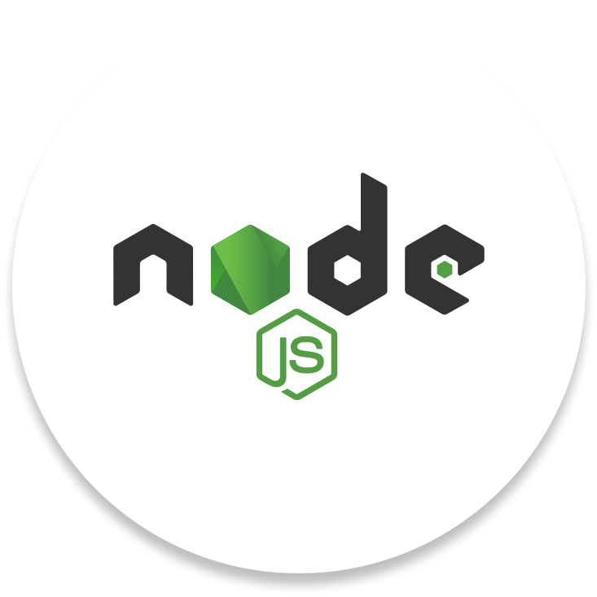
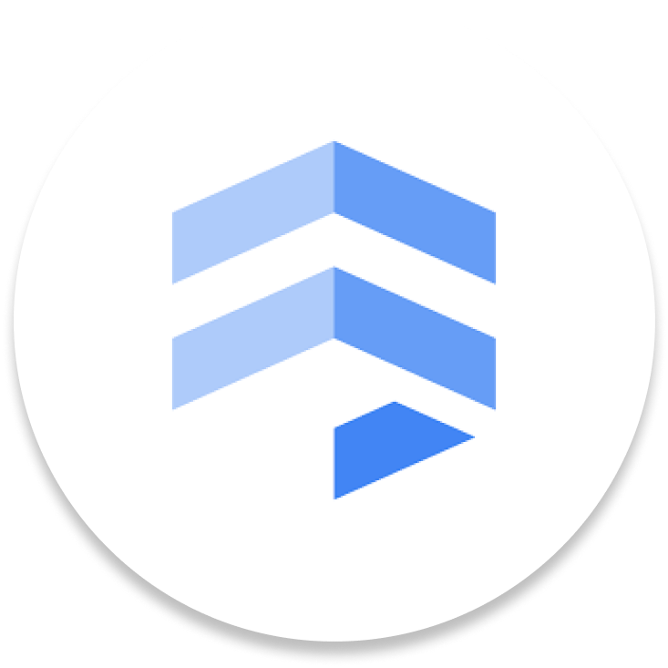

<br>
<div align="center">
    <div >
        
    </div>
    <div>
            <h3><b>Jendela</b></h3>
            <p><i>Everybody deserves a second chance.</i></p>
    </div>      
</div>
<br>
<h1 align="center">Jendela Backend Website</h1>
The backbone of second chances: Jendela's backend system powers the platform with robust and secure infrastructure, managing data seamlessly, facilitating real-time interactions, and ensuring smooth integration with training partners and employers. It's the engine driving the empowerment of ex-convicts, providing them with the tools and support they need to build a brighter future.

## 👨🏻‍💻 &nbsp;Technology Stack

<div align="center">

<a href="https://expressjs.com/">
<kbd>

</kbd>
</a>

<a href="https://nodejs.org/en">
<kbd>

</kbd>
</a>

<a href="https://firebase.google.com/">
<kbd>

</kbd>
</a>

<a href="https://gemini.google.com/">
<kbd>

</kbd>
</a>

<a href="https://cloud.google.com/ai/generative-ai?utm_source=google&utm_medium=cpc&utm_campaign=japac-SG-all-en-dr-SKWS-all-all-trial-DSA-dr-1605216&utm_content=text-ad-none-none-DEV_c-CRE_655856181068-ADGP_Hybrid+%7C+SKWS+-+BRO+%7C+DSA+-All+Webpages-KWID_39700076131769766-aud-2079991351570:dsa-1456167871416&userloc_9120800-network_g&utm_term=KW_&gad_source=1&gclid=CjwKCAjwqMO0BhA8EiwAFTLgIBkG-yewCpP2k5I1dFtTBUayxyP2uA4Sr5RgVWL9a3IIjH50OuF-RhoCHkYQAvD_BwE&gclsrc=aw.ds">
<kbd>

</kbd>
</a>

<a href="https://firebase.google.com/docs/firestore">
<kbd>

</kbd>
</a>

<a href="https://cloud.google.com/">
<kbd>

</kbd>
</a>

<a href="https://www.docker.com/">
<kbd>

</kbd>
</a>

</div>
<div align="center">
<h4>Express | NodeJS | Firebase | Gemini | Google GenAI | Firestore | Google Cloud | Docker</h4>
</div>

## ⚙️ &nbsp;How to Run
1. Clone this repository from terminal using this following command
    ``` bash
    $ git clone https://github.com/CUDA-Jendela/Jendela_Backend.git
    ```
2. Create a `.env` file inside the repository directory using `.env.example` file as the template. You can keep the variables blank. The server should automatically use port `8080` as the default port.
3. Run the server using this following command, make sure you have docker on your device.
    ``` bash
    $ docker-compose up -d
    ```
4. Glutara backend server should be running. You can also check the server by opening http://localhost:8080/api
    
## 🔑 &nbsp;List of Endpoints

| Endpoint                             |  Method  |   Usage  |
| ------------------------------------ | :------: | -------- |
| /api/auth/register                   | POST     | Users can register and create account on Glutara App

## 👥 &nbsp;Contributors

| <a href="https://github.com/mikeleo03"></a> | <a href="https://github.com/GoDillonAudris512"></a> | <a href="https://github.com/arleenchr"></a> | <a href="https://github.com/AustinPardosi"></a> |
| ---------------------------------------------------------------------------------------------------------------------------------------------------------------------------------------------------------------------------------- | ----------------------------------------------------------------------------------------------------------------------------------------------------------------------------------------------------------------------------------- | -------------------------------------------------------------------------------------------------------------------------------------------------------------------------------------------------------------------------- | ----------------------------------------------------------------------------------------------------------------------------------------------------------------------------------------------------------------------------- |
| <div align="center"><h3><b><a href="https://github.com/mikeleo03">Michael Leon Putra Widhi</a></b></h3><i><p>Bandung Institute of Technology</i></p></div>                                                                               | <div align="center"><h3><b><a href="https://github.com/GoDillonAudris512">Go Dillon Audris</a></b></h3></a><p><i>Bandung Institute of Technology</i></p></div>                                                                          | <div align="center"><h3><b><a href="https://github.com/arleenchr">Arleen Chrysantha Gunardi</a></b></h3></a><p><i>Bandung Institute of Technology</i></p></div>                                                               | <div align="center"><h3><b><a href="https://github.com/AustinPardosi">Austin Gabriel Pardosi</a></b></h3></a><p><i>Bandung Institute of Technology</i></p></div>                                                                            |